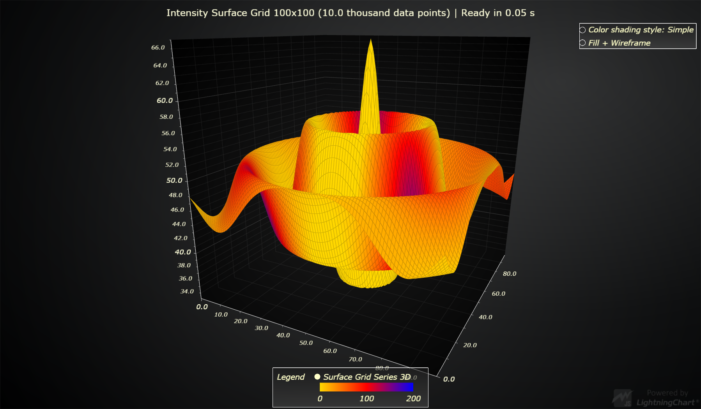

# JavaScript Intensity Surface Grid Chart

This demo application belongs to the set of examples for LightningChart JS, data visualization library for JavaScript.

LightningChart JS is entirely GPU accelerated and performance optimized charting library for presenting massive amounts of data. It offers an easy way of creating sophisticated and interactive charts and adding them to your website or web application.

The demo can be used as an example or a seed project. Local execution requires the following steps:

- Make sure that relevant version of [Node.js](https://nodejs.org/en/download/) is installed
- Open the project folder in a terminal:

        npm install              # fetches dependencies
        npm start                # builds an application and starts the development server

- The application is available at *http://localhost:8080* in your browser, webpack-dev-server provides hot reload functionality.

## Description

This example showcases the `SurfaceGridSeries` feature of LightningChart JS and more specifically its ability to process two different data sets:

- Height data set
- Intensity data set

Both of these data sets are structured similarly (one value for each column & row combination in surface grid), but serve different purposes. Height data set is used to alter the visible shape of the series, while the Intensity data set can **optionally** be used for coloring the series.

See [Surface Grid Chart Example](https://www.arction.com/lightningchart-js-interactive-examples/examples/lcjs-example-0912-surfaceGrid.html) for a usage scenario, which only uses the Height data set.

This example generates a different data set for Height and Intensity data, and colors the surface according to the Intensity data set, effectively forming a 4-dimensional data visualization (X, Y, Z, Color).

# More Surface Examples

- [Surface Grid Chart (only Y data)](https://www.arction.com/lightningchart-js-interactive-examples/examples/lcjs-example-0912-surfaceGrid.html) | This example showcases the most simple usage of surface grid series, and also has a bit more detailed description of the related terms.

- [Chunked Surface Grid Chart](https://www.arction.com/lightningchart-js-interactive-examples/examples/lcjs-example-0916-surfaceChunkLoad.html) | This example shows how surface grid series can be split into sub sections which are loaded individually for better performance and response time.

- [Real-Time Audio Spectrum Surface Chart](https://www.arction.com/lightningchart-js-interactive-examples/examples/lcjs-example-0913-surfaceScrollingGrid.html) | This example showcases using real-time data source with surface series.

- [All Surface Examples](https://www.arction.com/lightningchart-js-interactive-examples/search.html?t=surface)

## API Links

* [3D chart]
* [3D axis]
* [Paletted Fill]
* [Color lookup table]
* [Color RGBA factory]
* [Color shading styles (3D)]
* [Surface Grid Series]
* [Legend Box]
* [Axis scroll strategies]
* [Axis tick strategies]

## Support

If you notice an error in the example code, please open an issue on [GitHub][0] repository of the entire example.

Official [API documentation][1] can be found on [Arction][2] website.

If the docs and other materials do not solve your problem as well as implementation help is needed, ask on [StackOverflow][3] (tagged lightningchart).

If you think you found a bug in the LightningChart JavaScript library, please contact support@arction.com.

Direct developer email support can be purchased through a [Support Plan][4] or by contacting sales@arction.com.

[0]: https://github.com/Arction/
[1]: https://www.arction.com/lightningchart-js-api-documentation/
[2]: https://www.arction.com
[3]: https://stackoverflow.com/questions/tagged/lightningchart
[4]: https://www.arction.com/support-services/

© Arction Ltd 2009-2020. All rights reserved.

[3D chart]: https://www.arction.com/lightningchart-js-api-documentation/v3.3.0/classes/chart3d.html
[3D axis]: https://www.arction.com/lightningchart-js-api-documentation/v3.3.0/
[Paletted Fill]: https://www.arction.com/lightningchart-js-api-documentation/v3.3.0/classes/palettedfill.html
[Color lookup table]: https://www.arction.com/lightningchart-js-api-documentation/v3.3.0/classes/lut.html
[Color RGBA factory]: https://www.arction.com/lightningchart-js-api-documentation/v3.3.0/globals.html#colorrgba
[Color shading styles (3D)]: https://www.arction.com/lightningchart-js-api-documentation/v3.3.0/
[Surface Grid Series]: https://www.arction.com/lightningchart-js-api-documentation/v3.3.0/
[Legend Box]: https://www.arction.com/lightningchart-js-api-documentation/v3.3.0/classes/chartxy.html#addlegendbox
[Axis scroll strategies]: https://www.arction.com/lightningchart-js-api-documentation/v3.3.0/globals.html#axisscrollstrategies
[Axis tick strategies]: https://www.arction.com/lightningchart-js-api-documentation/v3.3.0/globals.html#axistickstrategies

